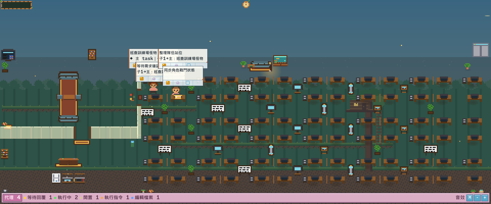

<h1 align="center">Maple Agent Market</h1>

<p align="center">
  把 Codex 與其他 AI coding agents 的工作狀態，變成一座會開店、等待、移動與練功的 2D 像素市場。
</p>

<p align="center">
  <strong>非官方社群 side project</strong> · Windows 優先 · Rust · 本機運作 · 無遙測
</p>

<p align="center">
  <a href="#快速開始">快速開始</a> ·
  <a href="#目前功能">目前功能</a> ·
  <a href="#自訂本機素材">自訂素材</a> ·
  <a href="#專案來源與完整署名">來源與署名</a> ·
  <a href="docs/OPEN_SOURCE_RELEASE.md">公開發布邊界</a>
</p>



> 上圖由目前原始碼的 `floating_snapshot` 實際渲染，未載入本機私有素材包。朋友乾淨 clone 後即可取得相同的公開安全版介面。

## 這是什麼

Maple Agent Market 是一套桌面上的 agents orchestration visualizer。它把每個 AI agent session 映射成一名 2D 像素角色，讓你不用反覆切換多個終端機，也能快速看出誰正在執行、誰在等待回覆、誰已閒置，以及哪些角色屬於同一個主任務。

目前產品介面以「市場擺攤」與「訓練場」作為狀態隱喻：工作中的 agent 保持開店或戰鬥，等待中的 agent 收店待命，閒置角色會在場景中活動，結束後再走向出口。這不是遊戲，也不會控制你的 agents；它只讀取本機 agent 事件與 transcript，轉成一眼可讀的動畫狀態。

## 目前功能

- 自由市場與訓練場可同時顯示，也可只展開其中一張地圖。
- Active、Waiting、Idle、Entering、Exiting 等狀態使用不同動作呈現。
- 工作中的市場角色持續開店；訓練場角色會使用程式繪製的泛用技能效果。
- 顯示主 task 與子代理的親子關係、層級與家族色，未提供 `parent_id` 的來源不會被猜測分組。
- 執行命令成功與 task 完成分別有一次性特效；完成特效為原創程式繪製，不含遊戲影格。
- 浮動視窗支援拖曳、右下角縮放、三種尺寸預設、地圖切換與隱性關閉快捷鍵。
- 可使用內建公開素材直接執行，也可在本機載入使用者有權使用的自訂 sprite pack。
- 支援 Codex、Claude Code，以及 Pixtuoid 架構既有的多種 agent sources；實際可偵測項目可用 `sources` 指令查看。
- 完全本機運作，沒有 analytics、telemetry 或自動上傳 session 內容。

### 浮動視窗操作

| 操作 | 功能 |
|---|---|
| `Esc` | 關閉目前聚焦的浮動視窗 |
| `1` / `2` / `3` | 雙地圖 / 市場 / 訓練場 |
| `Tab` | 循環切換地圖顯示模式 |
| `z` | 循環切換小 / 中 / 大視窗預設 |
| `m` | 靜音 / 取消靜音 |
| `+` / `-` | 調整音量 |
| 滑鼠左鍵拖曳 | 移動無邊框視窗 |
| 右下角拖曳 | 自由縮放視窗 |

## 快速開始

### 需求

- [Git](https://git-scm.com/)
- [Rust](https://www.rust-lang.org/tools/install) 1.89 或更新版本
- Windows、macOS 或 Linux；目前 Maple 浮動視窗主要在 Windows 驗證

> Windows 建議 clone 到較短的路徑，例如 `C:\dev\maple-agent-market`。部分繼承的測試 fixture 檔名較長，過深路徑可能碰到舊式 Win32 路徑長度限制。

### 1. Clone 與編譯

```powershell
git clone https://github.com/SaM-runtime/maple-agent-market.git C:\dev\maple-agent-market
Set-Location C:\dev\maple-agent-market
cargo build --locked -p pixtuoid
```

目前為了保留既有設定、hook 與 wire contract，相容層的 crate 與執行檔名稱仍是 `pixtuoid`；顯示名稱則是 Maple Agent Market。

### 2. 連接 Codex

先預覽本機能偵測到哪些來源：

```powershell
.\target\debug\pixtuoid.exe sources
```

連接 Codex 會寫入對應的本機 hook 設定：

```powershell
.\target\debug\pixtuoid.exe connect codex
```

這是一個明確的本機設定變更。若只想先看介面，可以跳過連接步驟；要移除時執行：

```powershell
.\target\debug\pixtuoid.exe disconnect codex
```

### 3. 啟動浮動視窗

```powershell
.\target\debug\pixtuoid.exe --theme maple floating
```

保持視窗開啟後，再從 Codex 開始或繼續 task。session 被偵測到時，角色會依狀態進入對應場景。若沒有出現，先檢查：

```powershell
.\target\debug\pixtuoid.exe doctor
```

也可以啟動終端機版：

```powershell
.\target\debug\pixtuoid.exe --theme maple run
```

## 公開版與素材邊界

這個 repository 的目標是讓朋友能直接 clone、編譯、執行並一起修改。因此，GitHub 版只包含有明確再散布依據的內容：

| 隨 repo 提供 | 來源 / 授權 | 用途 |
|---|---|---|
| Maple Agent Market 原創修改與程式化特效 | 本專案貢獻者，MIT | 雙地圖狀態、擺攤 / 練功邏輯、UI 與泛用特效 |
| Pixtuoid 基礎程式與預設像素素材 | Ivan Wang / Pixtuoid，MIT | agent 事件架構、renderer、相容層與公開 fallback 素材 |
| Monaspace Neon | GitHub Next，SIL OFL 1.1 | 浮動視窗文字 |

下列內容**不會**隨 repo、release、binary 或 README 圖片提供：

- NEXON / MapleStory 的背景、角色、怪物、傳送點、商店框、技能影格或音樂；
- 遊戲截圖、WZ / client 拆包內容、Open API 紙娃娃與其轉檔或裁切衍生物；
- 使用者自己的皮膚、BGM、本機 active pack、cache 與測試截圖。

原因不是「是否營利」或「只有朋友會看到」，而是 GitHub 上傳與朋友 clone 都屬於複製及再散布。NEXON 的官方 Game IP 指引將角色、怪物、圖片、背景音樂與影片列為其 Game IP，且沒有把這些檔案授權為可併入 MIT repository 的開源素材。完整工程邊界請看 [`FORK_NOTICE.md`](FORK_NOTICE.md) 與 [`docs/OPEN_SOURCE_RELEASE.md`](docs/OPEN_SOURCE_RELEASE.md)。這是保守的公開發布設計，不是法律意見。

每次公開候選版都可執行素材與隱私稽核：

```powershell
python scripts\public-release-audit.py --selftest
python scripts\public-release-audit.py
```

稽核會檢查未核准媒體、私有素材路徑、音訊、封裝檔、憑證特徵與本機絕對路徑。已核准媒體的 SHA-256 與來源群組位於 [`policy/public-release`](policy/public-release)。

## 自訂本機素材

公開版可直接執行；如果你擁有可使用、修改與載入的素材，也可以建立自己的本機 sprite pack。請勿把沒有再散布權的素材提交到 pull request。

建立範本：

```powershell
.\target\debug\pixtuoid.exe init-pack .\my-local-pack
```

修改完成後驗證：

```powershell
.\target\debug\pixtuoid.exe validate-pack .\my-local-pack
```

只在本機載入：

```powershell
.\target\debug\pixtuoid.exe --theme maple floating --pack-dir .\my-local-pack
```

本機 BGM 可在 `~/.config/pixtuoid/config.toml` 指向使用者有權播放的 MP3、WAV、OGG 或 FLAC：

```toml
[audio]
muted = false
volume = 0.35
bgm-path = "C:/Music/your-licensed-track.mp3"
```

專案不含 YouTube downloader、不會串流 YouTube，也不會把本機 BGM 自動加入 Git。

## 給共同開發者

建立自己的 branch：

```powershell
git switch -c feature/my-change
```

最小驗證：

```powershell
cargo fmt --all -- --check
cargo test --workspace
python scripts\public-release-audit.py
```

如果已安裝 [`just`](https://github.com/casey/just)，提交前執行完整 gate：

```powershell
just preflight
```

架構與相容契約在 [`docs/ARCHITECTURE.md`](docs/ARCHITECTURE.md)，貢獻流程在 [`docs/CONTRIBUTING.md`](docs/CONTRIBUTING.md)，安全問題請看 [`SECURITY.md`](SECURITY.md)。

## 專案來源與完整署名

Maple Agent Market 是從 [Pixtuoid](https://github.com/IvanWng97/pixtuoid) 延伸的 source-code fork，fork 基準為 Pixtuoid `v0.16.0` 的 commit [`ac06cc00c3cf18f3f67eab730a37f0c7e5787fc8`](https://github.com/IvanWng97/pixtuoid/commit/ac06cc00c3cf18f3f67eab730a37f0c7e5787fc8)。Pixtuoid 由 Ivan Wang 建立，原始程式與預設素材依 [MIT License](https://github.com/IvanWng97/pixtuoid/blob/main/LICENSE) 提供；本 repo 保留其版權與授權聲明。

本 fork 在該基礎上新增或大幅改寫：

- Maple Agent Market 品牌與繁體中文介面；
- 市場擺攤與訓練場雙地圖呈現；
- agent 狀態、進退場、繩索路徑、怪物巡邏與角色動作映射；
- task / subagent 關係、商店字卡、角色 ID、訊息列與浮動視窗控制；
- 泛用技能、命令成功與 task 完成特效；
- 本機 skin workshop、sprite pack 匯入與公開發布稽核。

授權與 provenance 的單一查閱入口：

- [`LICENSE`](LICENSE)：Pixtuoid 原作者與本專案修改部分的 MIT 聲明；
- [`THIRD_PARTY_NOTICES.md`](THIRD_PARTY_NOTICES.md)：Pixtuoid、Monaspace 與媒體來源；
- [`FORK_NOTICE.md`](FORK_NOTICE.md)：fork 關係、非官方聲明與私有素材邊界；
- [`policy/public-release/media-licences.toml`](policy/public-release/media-licences.toml)：公開媒體的機器可讀來源 / 授權對照；
- [`policy/public-release/media-allowlist.sha256`](policy/public-release/media-allowlist.sha256)：已審核媒體的精確 hash inventory。

Pixtuoid 上游另外提及 [`pixel-agents`](https://github.com/pablodelucca/pixel-agents)、[`clawd-on-desk`](https://github.com/rullerzhou-afk/clawd-on-desk) 與 Claude Code Buddy 作為其靈感來源；這些專案不是 Maple Agent Market 的素材來源，也沒有把它們的圖像併入本 fork。

## 非官方聲明

本專案未受 NEXON、遊戲橘子、OpenAI、Pixtuoid 作者或上述第三方專案贊助、認可或背書。MapleStory、NEXON 與相關名稱、角色及標誌屬其各自權利人；本專案名稱中的「Maple」只用於描述這個非官方、懷舊 2D 像素市場主題，不代表官方產品。

## License

程式碼依 [`LICENSE`](LICENSE) 中的 MIT License 發布。第三方素材仍依各自授權；本機使用者素材不會因載入本程式而改為 MIT。
