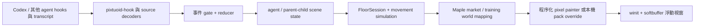

# 架構

Maple Agent Market 是 floating-only 桌面應用。使用者入口是 `maple-agent-market`，內部 crate 名仍保留 `pixtuoid-*`，以維持既有 hook、wire protocol 與設定路徑相容。

## Workspace

| Crate | 現行責任 |
|---|---|
| `pixtuoid-core` | agent ID、事件、source watcher / decoder、hook transport、reducer 與通用 sprite 格式 |
| `pixtuoid-scene` | 場景狀態、路徑與移動模擬、Maple world 分流、程序化 renderer、可選 pack override |
| `pixtuoid` | `maple-agent-market` CLI、設定、source 安裝、診斷、音訊與 floating window |
| `pixtuoid-hook` | 由各 agent 工具呼叫的輕量事件 shim |

## 為何還有 Pixtuoid 內部名稱

現行 Maple renderer 仍透過 `FloorSession::render_maple` 呼叫共用 `sim_step`，而 `sim_step` 使用上游的 layout、pose、motion、pathfinding 與 reducer 狀態。hook 設定也仍以既有 `pixtuoid-hook` wire contract 傳輸。這些都是 runtime 相依，不是單純品牌殘留。

本次清理已移除不在這條呼叫鏈上的終端 TUI、舊辦公室 sprite、範例角色 pack、舊 pack 建立器與上游封裝用 CLI。後續若要改名或拆掉共用 layout，應另做帶 migration 的架構重構，不可只刪檔。

## 內建畫面與 pack

乾淨 clone 使用原創 Rust 程序化 painter：背景、角色、攤位、怪物、傳點與技能都不需要外部 media。`crates/pixtuoid-scene/sprites/default/pack.toml` 是 metadata-only pack。

使用者可用 `--pack-dir` 覆寫已登錄的 optional Maple animation key。缺少 optional frame 時必須回到程序化 painter；提供了不完整的 animation cycle 則驗證失敗。renderer 不會自動連到 CDN、API 或素材站。

## 狀態責任

- source decoder 只產生可驗證事件；
- reducer 決定 agent lifecycle、task 與 parent-child 關係；
- scene simulation 決定移動與時間狀態；
- Maple world mapping 決定市場或訓練場呈現；
- painter 只把當下狀態轉成 pixels 與文字 overlay。

無 `parent_id` 的來源不會被 renderer 猜成子代理。
