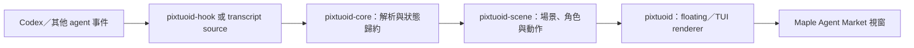

# 架構

Maple Agent Market 是 Pixtuoid 的桌面視覺化 fork。為了不破壞既有 hook、設定檔與事件格式，部分 crate、環境變數及執行檔名稱仍沿用 `pixtuoid`。

## 資料流

視覺化程式只觀察 agent 活動，不會替 agent 排程工作，也不會把 transcript 傳到網路服務。

## Workspace

| 路徑 | 責任 |
|---|---|
| `crates/pixtuoid-core` | source registry、hook 事件、session 狀態、parent/subagent 關係與 reducer |
| `crates/pixtuoid-scene` | 後端無關的像素場景、Maple 雙地圖、角色／怪物動作、程式化特效與 sprite pack 格式 |
| `crates/pixtuoid` | CLI、設定、source 連接、floating 視窗、TUI、音訊與作業系統整合 |
| `crates/pixtuoid-hook` | 低延遲、本機 IPC 的 hook shim |

依賴方向維持單向：`pixtuoid-core → pixtuoid-scene → pixtuoid`。`pixtuoid-hook` 是獨立的小型入口；核心與場景 crate 不應依賴視窗或終端後端。

## Maple 顯示層

- `crates/pixtuoid-scene/src/maple_world/`：雙地圖狀態、角色路徑、商店、訓練與 UI 模型。
- `crates/pixtuoid-scene/src/pixel_painter/maple/`：公開安全的程式繪製背景、角色狀態與特效。
- `crates/pixtuoid/src/floating/`：無邊框視窗、縮放、拖曳、地圖切換與輸入事件。
- `crates/pixtuoid/examples/floating_snapshot.rs`：在沒有私人素材包的情況下產生文件畫面。

## 素材邊界

Renderer 先嘗試載入使用者指定的本機 sprite pack；缺少對應素材時回到 repo 內可再散布的 Pixtuoid 預設素材與程式化畫面。NEXON／MapleStory 圖像、音樂、API 紙娃娃、遊戲截圖與衍生檔不屬於此架構的公開輸入，請保持在 repo 外。

`crates/pixtuoid/src/assets.rs` 是內容定址的本機素材管理層：`public-classic` 直接抽出 `pixtuoid-scene` 實際載入的 embedded default bytes；local import 只收集 `pack.toml` 引用的 regular files。兩條路徑都輸出排序後的逐檔 SHA-256 manifest，拒絕 symlink、路徑逸出、額外檔案與未受管理的強制覆寫。它不包含遠端 downloader 或上傳能力。

公開候選版的媒體與路徑規則由 `policy/public-release/` 和 `scripts/public-release-audit.py` 管理。
